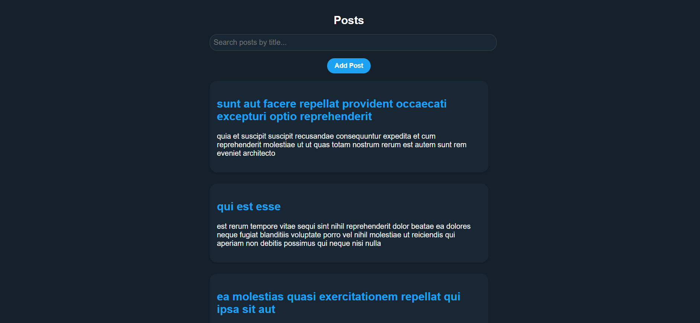
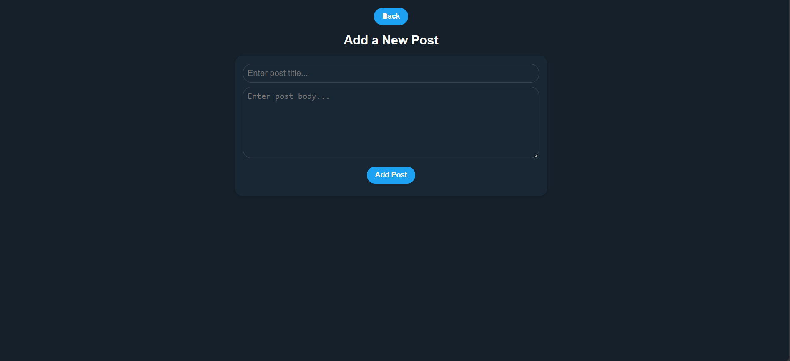
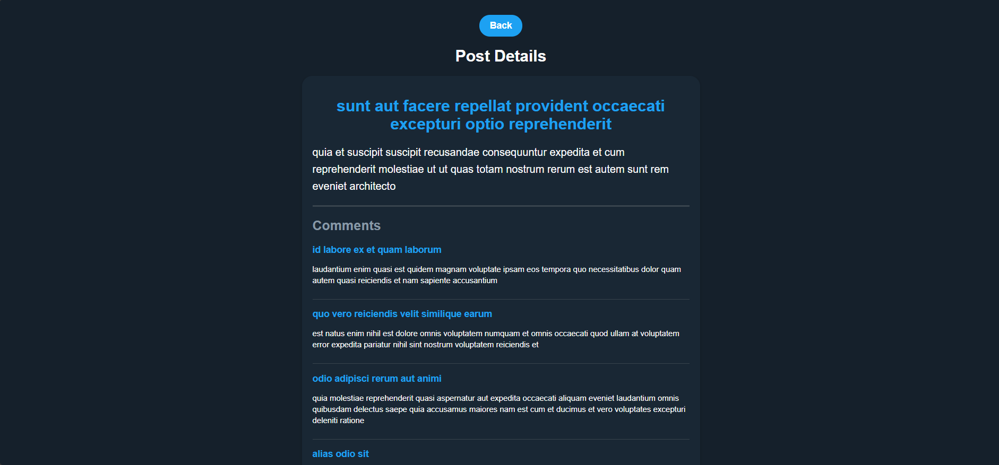
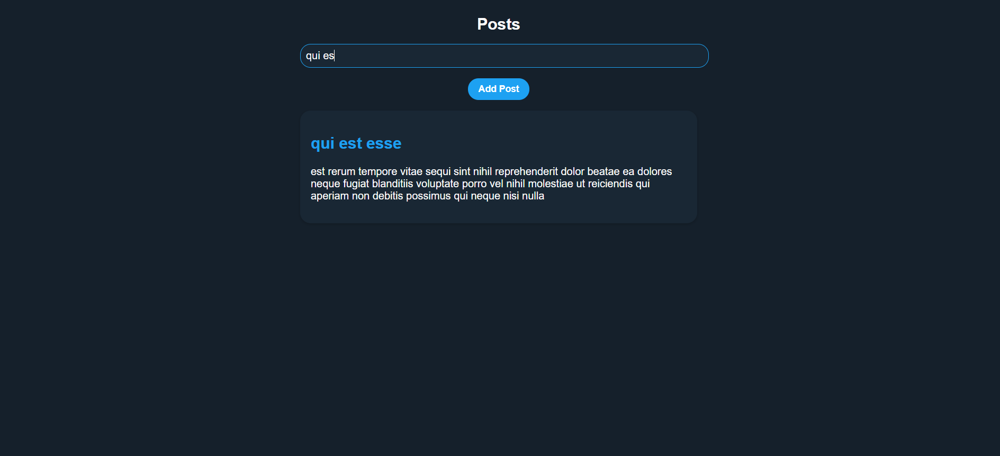

# React Posts Feed Application

## **Overview**
This is a React application designed to fetch, display, and manage posts and their details using the JSONPlaceholder API. The app supports searching posts, adding new posts, and utilizes global context for post management and error handling. It is fully responsive with a modern design.

---

## **How to Run**

### **Step 1: Clone the Repository**
```bash
git clone https://github.com/OriVered/Posts-Feed-Paygilant.git
cd Posts-Feed-Paygilant/client/
```

### **Step 2: Install Dependencies**
```bash
npm install
```

### **Step 3: Start the Development Server**
```bash
npm start
```
The application will be available at `http://localhost:3000`.

---

## **Pages**

### **1. Home Page**
- **Path:** `/`
- Displays:
  - List of posts in a centered column format.
  - A search bar for filtering posts by title.
  - A button to navigate to the "Add Post" page.
- **Key Features:**
  - Posts are fetched from the API on initial load and managed in the global context.
  - Responsive layout adapts for desktop and mobile.

### **2. Post Details Page**
- **Path:** `/posts/:id`
- Displays:
  - Detailed view of a single post.
  - Associated comments for the post in a styled list.
- **Key Features:**
  - Navigates back to the Home Page while maintaining context state.
  - Fully responsive and optimized for readability.

### **3. Add Post Page**
- **Path:** `/add-post`
- Allows users to:
  - Add new posts with fields for title and body.
  - Validate fields to ensure proper input.
- **Key Features:**
  - New posts are stored in global context and persist across navigations.
  - Responsive design for a clean and accessible form on all devices.

---

## **Features**

### **1. Fetch and Display Posts**
- **API Endpoint:** `https://jsonplaceholder.typicode.com/posts`
- Displays a list of posts in card format.
- Each post includes:
  - Title
  - Body

### **2. View Post Details**
- Clicking on a post navigates to its detailed view.
- **API Endpoint:** `https://jsonplaceholder.typicode.com/posts/{id}`
- Displays:
  - Post Title
  - Post Body
  - Associated comments fetched from `https://jsonplaceholder.typicode.com/comments?postId={postId}`.
- Comments are shown in a list format.

### **3. Search Posts**
- A search bar filters posts by title.
- Search is performed on the client side.

### **4. Add New Posts**
- Users can add new posts with a form.
- Fields include:
  - Title
  - Body
- New posts are added to global context and persist across navigations.

### **5. Global Context Management**
- **PostsContext**:
  - Fetches posts once and manages user-added posts in global state.
- **LoaderContext**:
  - Manages loading and error states globally.

### **6. Error and Loading Handling**
- Global **loading spinner** during API requests.
- Clear **error messages** displayed for failed requests.

### **7. Responsive Design**
- **Desktop**: Posts are displayed in the center column.
- **Mobile**: Posts occupy the full width of the screen.
- SCSS media queries ensure responsive layouts.

---

## **Technologies Used**
- **React**: Functional components with hooks.
- **React Router**: For navigation.
- **Axios**: For HTTP requests.
- **SCSS**: For styling.
- **Context API**: For state management.

---

## **File Structure**
```plaintext
src/
├── assets/
│   └── styles/
│       ├── global.scss
│       ├── variables.scss
│       ├── mixins.scss
│       ├── Home.scss
│       ├── PostDetails.scss
│       ├── AddPost.scss
│       ├── SearchBar.scss
│       ├── Loader.scss
├── components/
│   ├── Card.jsx
│   ├── Loader.jsx
│   ├── SearchBar.jsx
├── contexts/
│   ├── PostsContext.jsx
│   ├── LoaderContext.jsx
├── pages/
│   ├── Home.jsx
│   ├── PostDetails.jsx
│   ├── AddPost.jsx
├── api/
│   └── Api.js
├── consts/
│   ├── texts.js
│   ├── urls.js
├── App.jsx
├── index.js
```

---

## **Images**




---

## **Design Notes**

### **Global Contexts**
- `PostsContext`: Fetches posts once and manages both fetched and user-added posts.
- `LoaderContext`: Handles global loading and error states.

### **SCSS Structure**
- **`variables.scss`**: Contains color and spacing variables.
- **`mixins.scss`**: Includes reusable CSS patterns for buttons and layout.
- **`global.scss`**: Contains shared global styles for the app.

### **Responsive Layout**
- **Desktop**: Posts are displayed in a centered column (⅓ of the screen width).
- **Mobile**: Posts occupy the full screen width.

---

## **Future Improvements**
1. Implement pagination for posts to handle large datasets.
2. Add unit tests with Jest or React Testing Library.
3. Integrate a backend API for adding posts.

---
